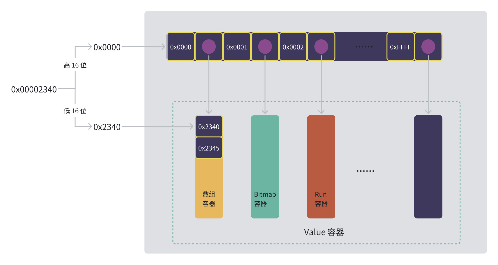
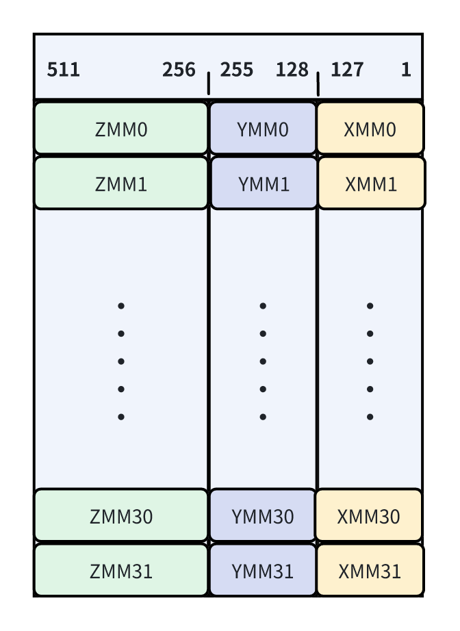
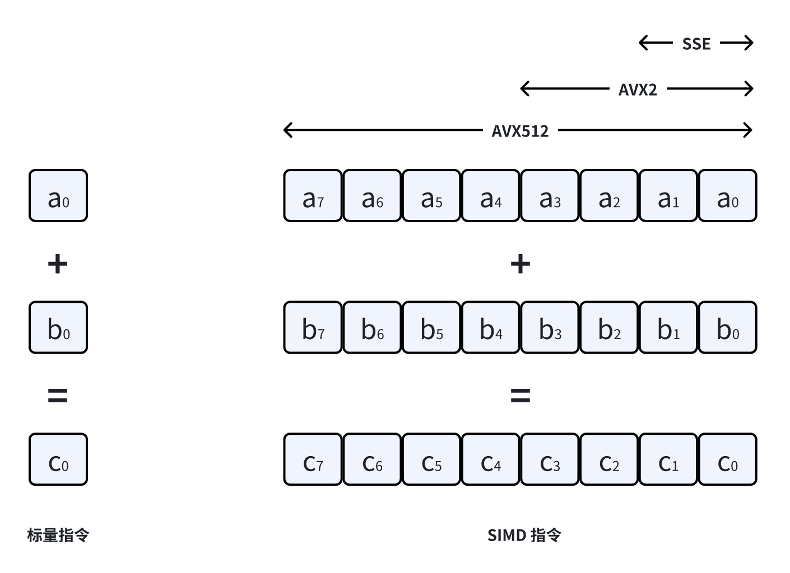

<!--  -->
<h1 align="center">  
  </img>  Roaring Bitmap 内幕  
</h1>

## 目录
<!-- START doctoc generated TOC please keep comment here to allow auto update -->
<!-- DON'T EDIT THIS SECTION, INSTEAD RE-RUN doctoc TO UPDATE -->
<!-- **Table of Contents**  *generated with [DocToc](https://github.com/thlorenz/doctoc)* -->

- [前言](#%E5%89%8D%E8%A8%80)
- [总体设计](#%E6%80%BB%E4%BD%93%E8%AE%BE%E8%AE%A1)
- [Value 容器](#value-%E5%AE%B9%E5%99%A8)
  - [数组容器](#%E6%95%B0%E7%BB%84%E5%AE%B9%E5%99%A8)
  - [Bitmap 容器](#bitmap-%E5%AE%B9%E5%99%A8)
  - [Run 容器](#run-%E5%AE%B9%E5%99%A8)
  - [容器的互相转换](#%E5%AE%B9%E5%99%A8%E7%9A%84%E4%BA%92%E7%9B%B8%E8%BD%AC%E6%8D%A2)
- [SIMD 基础](#simd-%E5%9F%BA%E7%A1%80)
- [访问操作](#%E8%AE%BF%E9%97%AE%E6%93%8D%E4%BD%9C)
- [逻辑计算](#%E9%80%BB%E8%BE%91%E8%AE%A1%E7%AE%97)
- [参考文档](#%E5%8F%82%E8%80%83%E6%96%87%E6%A1%A3)

<!-- END doctoc generated TOC please keep comment here to allow auto update -->

## 前言

Roaring Bitmap 是一个高性能的压缩 Bitmap 实现，与传统的基于 RLE (Run Length 编码) 的 Bitmap 实现 (WAH、Concise、EWAH) 相比，在计算性能和压缩效率上都有成倍的提升，并被广泛应用于许多生产平台，有很大的学习研究价值。

然而如果直接看论文或代码的话，可能会像我一样遇到很多困难，特别是在理解向量执行(SIMD)算法的时候。因此，这篇文章最主要的目标就是由浅入深的帮助大家理解 Roaring Bitmap 的设计与实现。不过在此之前，还是有必要对 bitmap 有一个基本的了解。

Bitmap 是一种使用 N 个 bit 表示在给定 [0, N) 区间，如果存在第 i 个元素，则第 i 个 bit 位为 1 的数据结构。例如当 N = 10 的时候，在给定 [0, 10) 的区间，存在 1, 3, 5, 6, 7, 8, 9 七个元素，那么对应的 Bitmap 为: 0101011111。相比于使用有序数组 [1, 3, 5, 6, 7, 8, 9]，Bitmap 使用一个 bit 位就能表示 32 位整数是否存在，这将有效节省内存并且大大提高运算效率。然而当 bitmap 中存在的元素比较稀疏，特别是当其数量 S < N/32 的时候，未经压缩的 bitmap 将不再有此优势。

## 总体设计



<!-- TODO 补充设计上下文 -->

Roaring Bitmap 最基本的设计思路是将一个 32 位无符号整型拆分成高 16 位和低 16 位的 key、value 对，其中高 16 位 key 存储在一个有序数组中，每个 key 指向存储该 key 低 16 位的 value 容器。Roaring Bitmap 支持数组、Bitmap、Run 三种不同的 Value 容器，以保证无论数据稀疏还是稠密，它都能获得最好的性能。

<!-- TODO 优化语句的流畅度 -->
作为 Bitmap 的一种实现，Roaring bitmap 需要支持访问操作和逻辑运算。访问操作用来定位指定的元素，执行增加、删除操作；而逻辑运算则通常作用于整个 bitmap，比如求交集，并集，差集等。由于 Roaring Bitmap 支持三种不同的 Value 容器，不同的 Value 容器之间进行逻辑运算需要使用不同的算法，这无疑增加了设计的复杂度。

## Value 容器

Value 容器用于存储 32 位无符号整型的低 16 位，每个 Value 容器共享相同的高 16 位 Key，使用不超过 8kB (大 B，表示 byte) 的内存（可以放入一级缓存），存储 [key x 2^16, (key + 1) x 2^16) 之间的元素。Value 容器底层使用数组存储，对于数组和 Run 这两个变长容器，在插入元素的时候按需动态扩容数组，并记录内存分配容量和容器内元素的数量。

### 数组容器

数组容器使用有序数组存储元素的低 16 位，最多存储 4096 个元素。当插入 4097 个元素的时候，会创建新的 bitmap 容器替代当前的数组容器，反之亦然。数组容器结构体的代码如下：

```c
STRUCT_CONTAINER(array_container_s) {
    int32_t cardinality; // 数组容器中元素的数量
    int32_t capacity; // 数组容器中元素的容量, 容量不够插入新元素，会进行扩容，直到达到 4096 的上限
    uint16_t *array; // 用于存储元素低16位的数组
};
```

数组容器的初始容量为 0，在写入元素的时候，按照需要的容量乘以扩容系数动态扩容。如果容量一下子扩得太大，并且写入的元素较少，就会浪费内存；如果容量扩得太小，增加的元素较多，则扩容过于频繁，影响写入速度。为了在这两者取得平衡，数组容器会基于当前容量的大小动态调整扩容系数，具体代码如下：

```c
static inline int32_t grow_capacity(int32_t capacity) {
    // 初始的容量为 0，延迟内存分配到增加元素的时候
    return (capacity <= 0) ? ARRAY_DEFAULT_INIT_SIZE 
                           // 需要的容量小于 64, 直接扩容为需要容量的两倍
                           : capacity < 64 ? capacity * 2 
                                           // 需要的容量小于 1024，直接扩容为当前的二分之三。
                                           : capacity < 1024 ? capacity * 3 / 2
                                           // 需要的容量大于 1024，扩容为当前容量的四分之五。
                                                             : capacity * 5 / 4;
}
```

### Bitmap 容器

Bitmap 容器固定使用1024 个 64 位机器字组成的数组来实现未压缩的 bitmap，并且可以表达 [key x 2^16, (key + 1) x 2^16) 区间的所有元素。Bitmap 容器存储的元素个数总是大于 4096，如果容器执行删除操作，使得元素的个数小于 4096，那么将创建新的数组容器替代当前的 Bitmap 容器。具体的 Bitmap 容器结构体代码如下：

```c
STRUCT_CONTAINER(bitset_container_s) {
    int32_t cardinality; // Bitmap 容器中元素的数量
    uint64_t *words; // 使用 1024 个 64 位机器字表达 bitmap
};
```

### Run 容器

Run 容器是使用 Run Length 编码存储元素的容器，而 Run Length 是使用 (value, run length) 对，表达连续元素的编码，例如 11,12,13,14,15 可以使用 (11, 4) 表达。（11, 4) 中的第一个数字 11 表示起始值，第二个数字 4 表示紧接着 11 之后的 4 个连续的值。Run 容器的结构体代码如下：

```c
struct rle16_s {
    uint16_t value; // 起始值
    uint16_t length; // run length, 紧接着 value 之后的元素个数
};

typedef struct rle16_s rle16_t;

STRUCT_CONTAINER(run_container_s) {
    int32_t n_runs; // 存储的 (value, run length) 对的个数 
    int32_t capacity; // 分配的内存容量
    rle16_t *runs; // (value, run length) 数组
};

```
<!-- TODO 描述 convert 的逻辑，见 convert.c 文件中的 convert_run_optimizer 方法 -->

### 容器的互相转换

## SIMD 基础

### SIMD 简介

SIMD(Single Instruction Multiple Data)即单指令流多数据流，简单来说就是使用一条指令在一个时钟周期内对多条数据执行相同的计算。大多数现代 CPU 设计都包含 SIMD 指令，Intel 1996 年就推出了 X86 MMX指令扩展，1999 年推出了全面覆盖 MMX 的 SSE 指令集，随后又相继推出了 SSE2、SSE3、SSE4、AVX2、AVX512 等扩展指令集。SSE 增加了 16 个新的 128 位寄存器(XMM0 - XMM15)，AVX2 又增加了 16 个 256位寄存器 (YMM0 - YMM15)，最后 AVX512 指令集在 XMM 和 YMM 寄存器的基础上，通过引入 ZMM 寄存器将位宽扩展到 512 位，并且将寄存器的数量增加到 32 个，其中 YMM 寄存器作为 ZMM 的低 156 位，而 XMM 又作为 YMM 的低 128 位，具体如下图所示：

<div align="center">
</img>
</div>

以 64 位整数相加为例，一条标量指令只能同时计算一对整数相加，而 SSE 指令可以同时计算 2 对整数相加，AVX2 指令能够同时计算 4 对整数相加，AVX512 指令更是能够同时计算 8 对整数的相加，具体如下图所示：
<div align="center">

</div>

在实际使用过程中，想要真正发挥 SIMD 的性能优势，需要遵循两个原则：

1. 数据使用连续内存布局 (发挥数据预取的优势，并且 load 无法从不连续的内存加载数据)
2. 数据内存对齐 ([C/C++内存对齐详解](https://zhuanlan.zhihu.com/p/30007037), [内存地址按照cacheline对齐的作用](https://zhuanlan.zhihu.com/p/579182410))
3. 设计没有条件分支的算法 (分支预测错误惩罚可能耗费很多时钟周期)。


### SIMD 使用

由于编译器的 Auto Vectorization 只能将没有数据依赖的简单循环优化成使用 SIMD 指令的向量实现，因此在大部分情况下，需要手写调用 SIMD intrinsics（SIMD 内建函数）的代码来实现最大数据并行。下面给出了使用 4 条 AVX2 指令实现 8 对浮点型相加的函数 `vector_add_eight_float` 示例以及它的等价标量函数 `add_eight_float` ：

```c
#include <immintrin.h>

void vector_add_eight_float(float *p1, float *p2, float *result) {
  __m256 a = _mm256_loadu_ps(p1); // 从 p1 的内存地址加载 256 bit 数据(8 个单精度浮点数)
  __m256 b = _mm256_loadu_ps(p2); // 从 p2 的内存地址加载 256 bit 数据(8 个单精度浮点数)
  __m256 c = _mm256_add_ps(a, b); // p1 和 p2 的 8 个单精度浮点数逐对相加，保存到结果 c
  _mm256_store_ps(result, c); // 将结果 c 存储到 result 内存地址
}

void add_eight_float(float *p1, float *p2, float *result) {
  for (int i = 0; i < 8; i++) {
    result[i] = p1[i] + p2[i];
  }
}
```

SIMD intrinsics 函数的基本格式位 `__mm<数据位宽>_<函数名>_<数据类型>`，以 `__mm256_add_ps` 为例，数据位宽为 256bit，函数名为 add，数据类型为 ps 表示单精度浮点数。更多 SIMD intrinsics 可以查看 [intel intrinsics guide](https://www.intel.com/content/www/us/en/docs/intrinsics-guide/index.html) 。


## 访问操作

## 逻辑计算

```c
input: an integer w 
output: an array S containing the indexes where a 1-bit can be found in w 
Let S be an initially empty list 
while w != 0 do 
  t ← w AND − w # 保留最右侧为 1 的 bit 位，其他 bit 位置 0
  append bitCount(t − 1) to S # t-1，
  w ← w AND (w − 1) # 将最右侧为 1 的 bit 位置 0
return S
```

``` c
pos = 0 
while (w != 0) {
 uint64_t temp = _blsi_u64(w); // 等价于 w AND -w
 out[pos++] = _mm_tzcnti_64(w); // 等价于 bitcout(t - 1)
 w ˆ= temp; 
}
uint64_t old_w = words[pos >> 6]; // 定位到 64 位 integer
uint64_t new_w = old_w | (UINT64_C(1) << (pos & 63)); // 设置比特位
// 是否增加了数据，更新基数，这里使用了无分支的算法
 cardinality += (old_w ˆ new_w) >> (pos & 63);
 words[pos >> 6] = new_w;
 ```

```Java
public static int bitCount(int i) {
    // HD, Figure 5-2
    i = i - ((i >>> 1) & 0x55555555);
    i = (i & 0x33333333) + ((i >>> 2) & 0x33333333);
    i = (i + (i >>> 4)) & 0x0f0f0f0f;
    i = i + (i >>> 8);
    i = i + (i >>> 16);
    return i & 0x3f;
}
```

``` java
public static int bitCount(int i) {
    i = (i & 0x55555555) + ((i >>> 1) & 0x55555555);
    i = (i & 0x33333333) + ((i >>> 2) & 0x33333333);
    i = (i & 0x0f0f0f0f) + ((i >>> 4) & 0x0f0f0f0f);
    i = (i & 0x00ff00ff) + ((i >>> 8) & 0x00ff00ff);
    i = (i & 0x0000ffff) + ((i >>> 16) & 0x0000ffff);
    return i;
}
```

```c
int32_t intersect(uint16_t *A, size_t lengthA , 
                  uint16_t *B, size_t lengthB , 
                  uint16_t *out) { 
  size_t count = 0; // size of intersection 
  size_t i = 0, j = 0;
  int vectorlength = sizeof(__m128i) / sizeof(uint16_t);
  __m128i vA, vB , rv , sm16; 
  while (i < lengthA) && (j < lengthB) {
    // 从数组 A，同时加载 8 个 16 位数字到向量 vA
    vA = _mm_loadu_si128((__m128i *)&A[i]);
    // 从数组 B，同时加载 8 个 16 位数字到向量 vB
    vB = _mm_loadu_si128((__m128i *)&B[j]); 
    // 逐对比较 16 位数字，并将比较的结果通过位掩码的方式返回。
    // 假设：
    //     A[8] = {1, 15, 24, 32, 74, 86, 96, 106}
    //     B[8] = {2, 15, 24, 33, 75, 86, 96, 106}
    // 则得到 bitmask：
    //     rv = 0b11100110, 最左侧的 1 表示 A，B 最右侧的数字对匹配
    // 之后基于 rv 得到 shuffle control mask：
    //     由于使用了 _mm_shuffle_epi8，一个小标表示 8 位，表示一个整数需要两个下标
    //     [02,03] [04,05] [10,11] [12,13] [14,15]
    //     15的下标 24的下标
    rv = _mm_cmpistrm(vB , vA ,    
       _SIDD_UWORD_OPS // 无符号 16 位字符
      | _SIDD_CMP_EQUAL_ANY // 
      | _SIDD_BIT_MASK); // 只返回位掩码
    // 抽取第一个 32 位数字
    int r = _mm_extract_epi32(rv , 0);
    // mask16 是一个搜索表，存放 cmpistrm 指令得到的 bitmask 到 shuffle control mask
    // 的一个映射，使用一维数组存，通过 (const __m128i *)mask16 + r 来取得对应的
    // shuffle controll mask
    sm16 = _mm_load_si128(mask16 + r); 
    // 基于 02,03,04,05,10,11,12,13,14,15, 0xFF, 0xFF, 0xFF, 0xFF, 0xFF, 0xFF
    // 的 shuffle control mask 提取出交集的结果，15,24,86,96,106,0,0,0，
    __m128i p = _mm_shuffle_epi8(vA, sm16); 
    _mm_storeu_si128((__m128i *)(out + count),p); 
    count += _mm_popcnt_u32(r); 
    uint16_t a_max = A[i + vectorlength - 1]; 
    uint16_t b_max = B[j + vectorlength - 1];
    if (a_max <= b_max) i += vectorlength; 
    if (b_max <= a_max) j += vectorlength; 
  } 
  return count;
}
```

## 参考文档

- [Roaring Bitmaps: Implementation of an Optimized Software Library](http://arxiv.org/abs/1709.07821)
- [Consistently faster and smaller compressed bitmaps with Roaring](http://arxiv.org/abs/1603.06549)
- [Better bitmap performance with Roaring bitmaps](http://arxiv.org/abs/1402.6407)
- [SIMD- and cache-friendly algorithm for sorting an array of structures](https://www.vldb.org/pvldb/vol8/p1274-inoue.pdf)
- [Fast Sorted-Set Intersection using SIMD Instructions](https://adms-conf.org/p1-SCHLEGEL.pdf)
- [Intel Intrinsics Guide](https://www.intel.com/content/www/us/en/docs/intrinsics-guide/index.html)
- 《代码之美》
